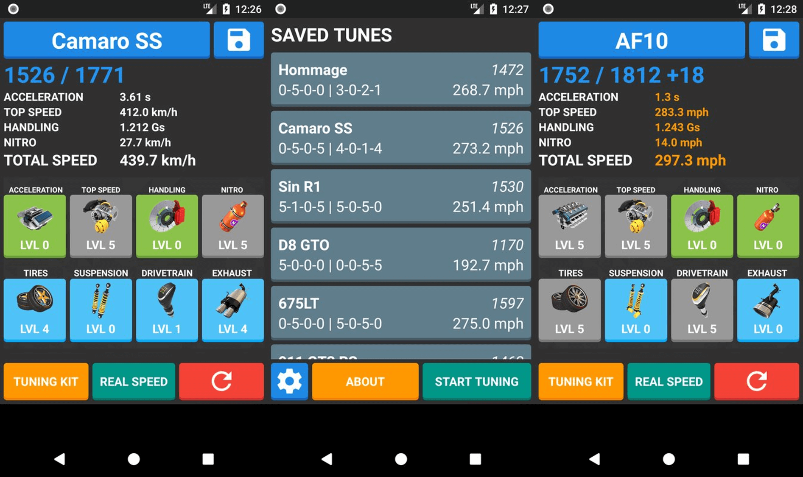

# A8 Tuner - A Vehicle Tuner Simulator for Vehicles of Asphalt 8: Airborne

Note: Uninstall the older A8 Tuner App before installing the newer version.

## Features

* Configurable MAX & PRO upgrades
* Tuning kit bonus calculations
* Real & fake speed calculations
* Save custom vehicle tunes
* Includes 190+ vehicles

## Disclaimer

The product names and images shown or represented are copyright and/or trademark of theirs respective copyright and/or trademark holders, which are in no way associated or affiliated with this application. Use of these names does not imply any co-operation or endorsement.

This application is developed and designed for educational purpose. **App does not include Advertisements or In-App purchases or Micro-Transactions.**

## App Content Licence

The app's content is licensed under [Attribution-NonCommercial 4.0 International (CC BY-NC 4.0)](https://creativecommons.org/licenses/by-nc/4.0/)
